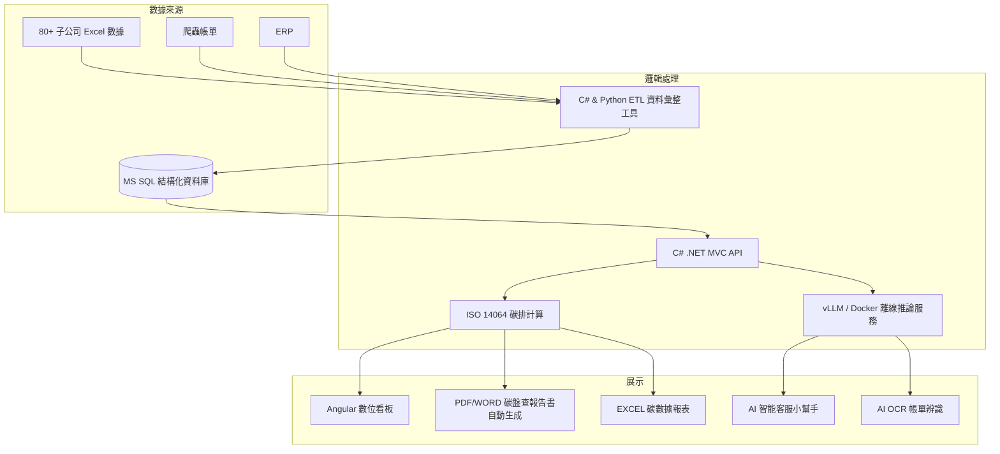

# 集團碳足跡平台

> 基於 C# .NET 與 Python 的碳盤查平台，整合 AI OCR 辨識與 智慧客服。

## 系統架構圖 

```mermaid
graph TD
    subgraph Layer3 [展示]
        A1[Angular 數位看板]
        A2[AI 智能客服小幫手]
        A3[PDF/WORD 碳盤查報告書自動生成]
        A4[EXCEL 碳數據報表]
        A5[AI OCR 帳單辨識]
    end

    subgraph Layer2 [邏輯處理]
        B1[C# .NET MVC API]
        B2[ISO 14064 碳排計算]
        B3[C# & Python ETL 資料彙整工具]
        B4[vLLM / Docker 離線推論服務]
    end

    subgraph Layer1 [數據來源]
        C1[(MS SQL 結構化資料庫)]
        C2[80+ 子公司 Excel 數據]
        C3[爬蟲帳單]
        C4[ERP]
    end

    %% 數據流向
    C2 --> B3
    C3 --> B3
    C4 --> B3
    B3 --> C1
    C1 --> B1
    B1 --> B2
    B2 --> A1
    B1 --> B4
    B4 --> A2
    B4 --> A5
    B2 --> A3
    B2 --> A4
```
